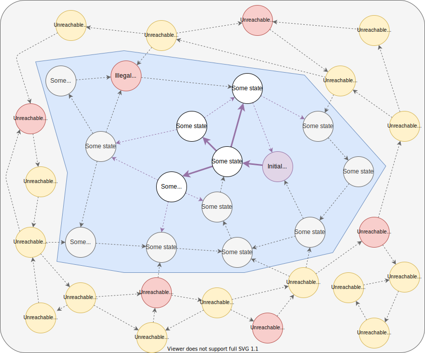

# What is formal verification?

Verification is the task of finding bugs and proving that our design works. 

Conventionally, we use simulation for verification, where we give either custom inputs or constrained random inputs to a system and make sure that we get expected outputs from it.

Formal verification is an alternative where we prove that the system works for any input combination! We use special tools that exhaustively search by trying out different inputs. In other words, we tell it the properties to check and it drives the inputs to prove or disprove that the properties hold.

Suppose we have a model, as shown below. There are a lot of states and each state can transition to several other states based on some input conditions. This is a state machine.

We do not know the exact structure of this graph when we implement our design, and need to check if it satisfies some properties as per our specification, as we will see going forward.


In a practical state machine with registers and stuff, there will be some states that can be represented, but will never be reached in a practical setting. In this graph representation, there wont be any outgoing edges from the states shown above to these unreachable states. Now our representation becomes


The blue region is the region our machine will operate in, the reachable subset of the state space. As a designer, we have a vague idea which states are unreachable, but we might not be able to give an exact conditions for unreachability.

So, the unreachable nodes here, are not known to the designer. They are labelled just for our reference. They will stay there, but we will ignore them in the beginning and come back to them

## Assertions and illegal states

Now, most of our properties define conditions that must be true. There will be states that violates these conditions. In verilog, we use ```assert``` statements to define these illegal states

```verilog
// Immediate assertion. 
// Any state that executes this statement with count >= 1000 is illegal
assert(count < 1000);
...

// Concurrent assertion.
// We define an event when the assertion is checked
assert property(@(posedge clk) count < 1000);
```

Some of these illegal states would also be unreachable. We may or may not have illegal states in our reachable subset of the state space. Let us assume we have one.


We also define one (or more) initial states, i.e states when the machine starts. This is done instead of checking all states at the start or choosing at random to make sure we dont end up searching in the unreachable state.

Our task now, is to find if there is a way to reach this illegal state from the initial state. Since we already have a graph, the obvious way is to do a breadth-first-search. Let us see what this looks like with a search space of 2



The formal tool here, applies all combinations of input conditions for 2 timesteps to exhaustively cover all the states that we could reach in 2 timesteps.

We have uncovered some states, but we havent looked long enough to come across the illegal state. Now, let us try simulating for 4 timesteps


There! The tool caught the illegal state. The formal tool has tried all combinations to come across an illegal state. It will report this to us. If we use symbiyosys, it also gives the trace file in ```.vcd``` format to see what input combinations and state transitions lead to this error, so that we can fix it, It also gives a verilog testbench that generates the input sequence that caused the error!

This mode is called the "**bounded model check**". We exhaustively check the state space to uncover illegal states from a given initial state. 

The issue with bounded model check is that it only proves that "**the model works for n number of cycles**". We cannot run it for a large number of cycles since the number of states would explode. So, it is not an exhaustive proof by itself alone.

For this, we use induction

## Induction

Now, instead of searching for the illegal state from the initial state, what if we searched backward for a path to reach the illegal state? This is exactly what induction does.

If we cannot find a path to an illegal state through n legal states, and we know that the initial n states are always legal (through bounded model check), we can be sure that our model never goes into an illegal state. 

This is based on mathematical induction, where we first prove that a property is tru for an initial condition (```k = 0```), then we prove that it is true for ```k+1``` provided it is true for ```k```. This then effectively proves the property for inifinity by recursion. The difference from the elementary induction we used in high school to the induction we use here is that we prove it not for one state but for a sequence of ```n``` states.

So, combined success of bounded model check for n cycles nd failure to find a valid path for n cycle ending in an illegal state proves the model.

Its all great now, but there are some major problems that make this quite difficult in practice.

The task is to find a path that ends in an illegal state but has n legal states before it. Let us see this in action for a search of 2 subsets


Let us assume that the model only checks the illegal state in the reachable subset. It does track those in the unreachable subset as well, but we will come back to it.

We can see that it has found several paths to reach the illegal state with a valid path of size 2. We can also see how it avoided a path that had an illegal (and unreachable) state because it needs to find a path through legal states only.

Our tool will now report one of these paths to us, with the trace file as well. We can see that in this trace file, the solver chooses the initial value of the variables. It just needs to find a way to the illegal state.

This has indeed caused an issue where it found a path started from an unreachable state! The solver just finds a backward path and does not care if that path would happen in real life. In reality, that state would never be reached from our initial condition and so that path is invalid as well.

This is the pitfall of induction. It is a bit tricky to get a valid proof because the solver finds some way to start from an unreachable state to reach some illegal state! 

## Assume statement and how to make induction work?

The fundamental problem is, the solver does not know which states are unreachable. It would have to check for a very long time to completely cover the reachable subset and say "*there are no new states to add*", but that is ridiculously impractical! And, the designer cannot give a comprehensive definition of unreachable or reachable states. Now let us see how we can overcome this.

To make the problem more clear, let us remove the illegal state inside the reachable subset and see what happens for a search of 5 timesteps


As we can see, the design is bug-proof if it starts from a good initial condition, but the solver finds paths to reach illegal states through unreachable states. 

Here too, we can see that all path need to pass through legal states. One solution could be to increase the number of timesteps to make sure that the paths that start from nowhere, or an illegal state, detect that and get flushed out. Let us try 10 timesteps


Well, that elimintad some of the paths, but there are some left. They originated from a cycle in the state space! Another possibility is if our state space was so was and connected that we cannot practically search for enough timesteps to flush everything.

In practice, when we encounter such a situation, we would analyze the trace and think "*how can i tell the solver that this is invalid*". One way could be to add more assertions and add invalid states. For example, here, adding one illegal state in the cycle would solve it!


Assertions add invalid states to the system, so we are constrained by the specifications not to add unnecessary invalid states, or else we might end up adding illegal states in the reachable subset. A way to invalidate paths without adding assertions is to add ```assume``` statements. 

They are effectively like ```assert``` statements, only difference being violations will not be reported as errors.

We can be a bit more liberal with ```assume``` statements. For example, we assume that an operations will not be enabled by an extenal input unless we say it is ready to be executed. This could invalidate some nodes in the reachable subset, but could be worth the cost.


Note that we could not do this with assert because the reachable invalid state would become an illegal state, and be detected as an error.

We need to be wary of assume statements because it terminates not only induction checks, but also bounded model checks. This can be used to good effect if we have some way to get to an unreachable state that is practically not possible due to constraints on the input.

For example, if we add one edge, we can have a way to reach the "unreachable" subset. 


This edge, however is irrelevant and we are sure that it wont happen in normal operation. So, we define the next state as invalid. Else, bounded model check will find a path to an illegal state outside our "reachable subset" as shown (this wont happen in reality because of the invalid state).

Note : Here, the "reachable subset" is defined subject to our idea of reachability, i.e subject to some input conditions. It can be reached if those assumptions are ignored.

Assume can also be used to restrict our test to some subset of the state space. This could be done to only test some features of the model at a time. For example, if we know we havent implemented some features and there will be assertion failures if they are used, we could block those feaures away, to make sure our implemented part is working fine.

Check this example where we do a bounded model check for an arbitrarily large number of timesteps with 2 invalid states (defined using assume)


System verilog has a variant of ```assume``` called ```restrict``` just for restricting our formal testing to some conditions. The only difference is that if ```assume``` is encountered in normal simulation (not using formal tools), it is reported as an error but restrict is ignored. 

To illustrate the difference, let us assume a peripheral that is bus slave. We have some assume statements assuming that the bus master gives good signals according to the bus specificiation. While we implement the module, we then might have some restrict statements restricting the bus transactions that take place, so that we can test only the implemented functionality. The difference comes during simulation. If the assume statemetns are broken, it means the master put illegal bus transactions, which needs to be reported! If restrict is broken, it means features are used that were not formally tested, which is ok!

Assume statements must be used carefully. For example, if we had defined the above invalid states by mistake, the checks would not have found our reachable illegal state.

If the proof succeeds, we can say "these assertions hold subject to these assumptions". So, our proof is only as good as our assumptions and assertions.

## Cover

Now what if we have designed our system and need to see an example of a transaction where we expect something at the end, just to see if the system works. The cover statement and cover mode is used for such situations.

The cover statement is identical to the assume and assert statements. It also has an immediate and concurrent form.

For example, if we say

```verilog
cover property(@(posedge clk) count == 100);
```

The solver tries to find a way to get count to 100. If there are multiple cover statemetns, it finds the shortest route through all of them. The cover property only needs to be true once. If it is false, no harm!

Example :


The tool would give a trace file to show how the cover statements were met. If there were assertion failures along the way, they would be reported as well!

The cover statement is also run in simulation where at the end the simulator would report the number of times the statement was tested and the number of times the test succeeded.

---

# An example

Let us look at an example of formal methods to prove a counter model. 

Let us consider a decade counter (count to 10, then reset). We define a property that the count must be < 10. The verilog code would be :

Let us start with only a simple bounded model checks.

```verilog
module counter(
    input i_clk,
    output[3:0] reg o_count;
);
    initial o_count <= 0;

    always @(posedge i_clk)
        if(o_count == 9)
            o_count <= 0;
        else
            o_count <= o_count + 1;

    always @(*)
        assert(o_count < 10);

    reg f_past_valid = 0;
    always @(posedge i_clk) begin
        if(f_past_valid)
            assert(o_count == $past(o_count) + 1);
        f_past_valid = 1;
    end
endmodule
```

The state diagram would look like :


The purple edges are how a bounded model check would proceed. We can exhaust all the possible states here since it is quite small.

If we removed the roolback to 0 from 9, as

```verilog
module counter(
    input i_clk,
    output[3:0] reg o_count;
);
    initial o_count <= 0;

    always @(posedge i_clk)
        o_count <= o_count + 1;

...
endmodule
```

Then the state diagram would be :


The error would be reported for any bounded model check with timestep > 9.

Now, let us increase the counter size to be 10 bits in size with a rollback at 1000.

```verilog
module counter(
    input               i_clk,
    output[9:0] reg     o_count;
);
    initial o_count <= 0;

    always @(posedge i_clk)
        if(o_count == 1000)
            o_count <= 0;
        else
            o_count <= o_count + 1;

    always @(*)
        assert(o_count < 1001);

    reg f_past_valid = 0;
    always @(posedge i_clk) begin
        if(f_past_valid)
            assert(o_count == $past(o_count) + 1);
        f_past_valid = 1;
    end
endmodule
```

Now, the state diagram looks like this for a bounded model check for 100 timesteps. We know that at 1000, the design causes a rollback. 


But, the BMC only checked for 100, so we havent proved it. If instead we removed the rollback, the BMC wouldnt have caught the error.

```verilog
module counter(
    input               i_clk,
    output[9:0] reg     o_count;
);
    initial o_count <= 0;

    always @(posedge i_clk)
        o_count <= o_count + 1;

    always @(*)
        assert(o_count < 1001);

    reg f_past_valid = 0;
    always @(posedge i_clk) begin
        if(f_past_valid)
            assert(o_count == $past(o_count) + 1);
        f_past_valid = 1;
    end
endmodule
```

The state diagram for BMC of 100 size (passed)


Now, if we run an induction check on this for a size of 100, it does find the error.


If we remove the bug, we can prove this with just one timestep!


We see that there is no way to get to an illegal state from any legal state, and we get to a legal state from the initial state. So, the design has been proved.

This illustrates why BMC is insufficient to prove the system properties. It needs to be combined with induction for a full proof of the system
