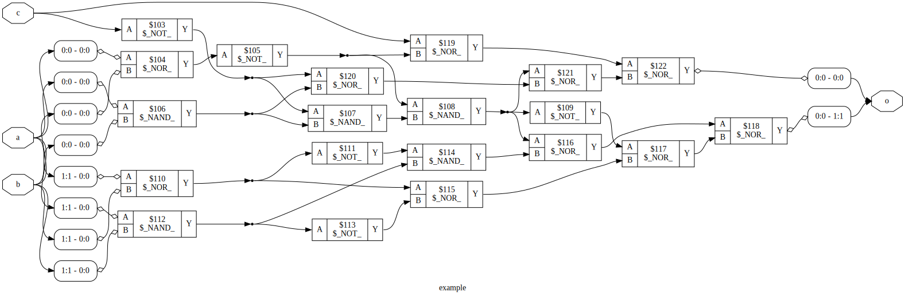

# Logic synthesis exploration with Yosys

A brief overview of Yosys and exploring logic synthesis using yosys.

---

# I) What does it do?

Yosys handles logic synthesis. Basically, transforming logic from a higher level of abstraction to lower levels.

Steps or stages in synthesis (Ref: Yosys manual) :


Yosys can perform sythesis from the behavioral level to the physical gate level.

#### 1) Behavioral level

Describing the behavior of the circuit, without lower level details. Usually using always blocks

```verilog
always @(posedge clk)
    out = inp1 + inp2;
```

#### 2) RTL level

In the RTL level as defined in yosys, the combinational logic and registers are separated.

The implementation is much more "structural" than conventional "RTL designs". For example, combinational blocks are modeled by assign statements and memory elements using always blocks.


```verilog
assign sum = inp1 + inp2;

always @(posedge clk)
    out = sum;
```

#### 3) Gate level

Hierarchical, completely structural modelling (only describes connections between components). In the end the circuit is defined in terms of single-bit cells (gates , MUXes, LUTs).

```verilog
adder #(.width(8)) add1(.out(sum), .in1(inp1), .in1(inp2));

register #(width(8)) outreg(.out(out), .inp(sum), .clk(clk));
```

Physical gate level contains physically available gates. The logical gate level is optimized and mapped to the physical gate level. For ex, logical gate level might contain AND, XOR, etc while physical gate level might only have NAND, NOT, NOR.

This is done by logical synthesis tools that basically do the equivalent of **k-map solving** but with lower algorithmic complexity. Algorithms like Binary-Decision-Diagram (BDD) or And-Inverter-Graph (AIG) are used for this. Yosys can use the [ABC](https://people.eecs.berkeley.edu/~alanmi/abc/) library from berkley for this.

#### 4) Switch level

Switch level modelling can be done in verilog where the circuit is described using individual transistors. However, this is not popular and modern design flows use gates as basic building blocks.

It is essentially structural modeling with instantiations of nmos, pmos, transmission gates, buffers, etc.

---

# II) Basic architecture

Yosys has a very modular architecture. It  uses a format called **RTLIL** (Register-Transfer-Level-Intermediate-Language) for representing logic at all levels. Different "**passes**" that transform the logic in RTLIL representation. Some of these passes may be optimizations, others may map logic to some given set of components.

Apart from passes, there are "**frontends**" and "**backends**". The frontends are the inputs to yosys and can be used to read some HDL code or other logic representation into the RTLIL representation, and the backends are the outputs and convert the RTLIL representation into some output to be used by other tools in the FPGA / ASIC flow.

Essentially, the synthesis flow consists of a frontend, several "passes" that perform the synthesis and optimization and a backend.

Yosys architecture (Ref. Yosys manual)


Each of these are accessed by yosys commands

---

## III) Frontend, backend and misc commands

1) ```read_verilog <filename>```
    - Reads verilog into internal RTLIL representation

2) ```show```
    - Renders a graph of all the subcomponents in the RTLIL representation

3) ```write_ilang <filename>```
   - Write to the ILANG format. The ILANG format is a text representation of RTLIL

4) ```write_verilog <filename>```
   - Write to verilog (only after converting to the RTL level by running ```proc```)

5) ```write_spice <filename>```
   - Write to a spice netlist

6) ```help <command>```
    - Print information about the command

7) ```exit```
    - Exit the yosys commandline

8) ```stat```
    - Prints different statistics (number of cells, etc)

9) ```check```
    - Checks for the following issues in the design
      - Combinatorial loops
      - Two or more conflicting drivers for one wire
      - Used wires that do not have a driver


---

# Typical flow

Yosys can be run in either an interactive commandline mode by simply calling ```yosys``` from the commandline, or can take a script as an input, like ```yosys synth.ys```

The following is the usual synthesis flow in yosys (Ref: Yosys manual)

The first and last commands are the frontend and backend respectively. All other commands are "passes". Next, lets see what these passes do individually, with some examples

```bash
# read input file to internal representation
read_verilog design.v

# convert high-level behavioral parts ("processes") to d-type flip-flops and muxes
proc

# perform some simple optimizations
opt

# convert high-level memory constructs to d-type flip-flops and multiplexers
memory

# perform some simple optimizations
opt

# convert design to (logical) gate-level netlists
techmap

# perform some simple optimizations
opt

# map internal register types to the ones from the cell library
dfflibmap -liberty cells.lib

# use ABC to map remaining logic to cells from the cell library
abc -liberty cells.lib

# cleanup
opt

# write results to output file
write_verilog synth.v
```

---

## ```proc``` pass

- Converts "process" blocks into multiplexer, latches and registers

For example, in the [counter.v](examples/counter/counter.v) example
```verilog
module counter(
    input clk,
    input nrst,
    input en,

    output[7:0] count
);

    reg[7:0] count;

    always @(posedge clk) begin
        if(~nrst)
            count <= 0;    
        else if(en)
            count <= count + 1;
    end

endmodule
```

The bare input after reading verilog is:


After proc:


We can see how the  always block mapped to a "PROC" block after reading and was then mapped to multiplexerrs and flip flops in the ```proc``` pass.

---

## ```opt``` pass

This pass performs several common optimizations which are also independent passes themselves. These include

#### ```opt_expr```
- Simplifies expressions with constant or unknown inputs.
- Example : ```a & 0``` -> ```0``` and ```a & 1``` -> ```a```

#### ```opt_muxtree```
- Simplifies multiplexer trees by removing branches that will never be taken
- For example, 
```verilog
assign out = s ? (s ? b : a) : 1'b0;
```
- Output can never be ```a``` because of the way the selections are nested. This will be optimized
- Before opt_muxtree  
- After opt_muxtree 

#### ```opt_reduce```

- Handles optimizations with reduction AND and OR operations (```&(inp)```, ```|(inp)```). 

- Example : If two inputs in the reduction vector are the same, they are merged together.

#### ```opt_rmdff```

- Identifies and removes flop flops whose values never change

#### ```opt_clean```

- Identifies and removes unused signals and cells

#### ```opt_merge```

- Performs resource simple sharing by merging blocks with the same inputs. 

- Example: for the behavioral block

```verilog
assign out = s ? (a + 8'd5) + b : (a + 8'd5) + c;
```

Before ```opt_merge```

After ```opt_merge```


```$1``` and ```$3``` blocks had the same inputs so they were merged. However, it must be noted that if the code is instead written as

```verilog
assign out = s ? a + b + 8'd5 : a + c + 8'd5;
```

The optimization will not take place because of the precedence of the additions, and since yosys does not consider the associativity of addition for merging. This is done by other logic optimization engines like "**abc**"


The whole flow of opt is as follows (in pseudo-code)

```c
opt_expr

opt_merge

do{
    opt_muxtree

    opt_reduce

    opt_merge

    opt_rmdff

    opt_clean

    opt_expr
} while (circuit is stable)
```

Normally, these optimizations are run after any major transformation pass using the opt command

Refer the [Optimizations chapter](https://yosyshq.readthedocs.io/projects/yosys/en/latest/CHAPTER_Optimize.html) in the manual for more details

---

## ```memory``` pass

Initial memory pass. If called with ```-nomap``` option, multi-port memories are retained. Else, all memory is converted to D flip flops and decoder circuits.

For example, for a 4 byte memory with synchronous read as below,
```verilog
reg[7:0] mem[3:0];

always @(posedge clk) begin
    data_out = mem[addr_out];

    if(write_en)
        mem[addr_in] = data_in;
end
```

Before the ```memory``` pass, the read and write processes are described by individual blocks ```$memwr``` and ```$memrd```


With the ```-nomap``` flag, after ```memory``` pass, the output is


However, without the ```-nomap``` option, the ```$mem``` block is replaced by decoders, multiplexers and DFFs.


---

## ```techmap``` pass

Converts the primitives into gates or components from a library. Without any options, it uses a builtin default library. For example, a two-bit adder before ```techmap```:


After ```techmap```, it is converted to AND and XOR gates to implement the add blocks.


---

## ```abc``` pass

After ```techmap```, we can convert the cells into a specific set of logic gates also use the ```abc``` pass. 

This is useful if we need to check say, how to implement our circuit using only multiplexers, or only using NAND gates and so on. It can also be used to convert a gate-level verilog netlist into some other technology (FPGA LUTs to CMOS for ex)

The ```-g``` option can be used to specify what gates to use as a comma separated list. It includes

- AND
- NAND 
- OR 
- NOR 
- XOR 
- XNOR 
- ANDNOT 
- ORNOT 
- MUX 
- NMUX 
- AOI3 
- OAI3 
- AOI4 
- OAI4

So, we can say, for example ```abc -g AND,OR,NOT```

There are shortcuts for sepcific sets of these
| Shortform      | Gates |
|---|---|
| simple    | AND OR XOR MUX    |
| cmos2     | NAND NOR  |
| cmos3     | NAND NOR AOI3 OAI3    |
| cmos4     | NAND NOR AOI3 OAI3 AOI4 OAI4  |
| cmos      | NAND NOR AOI3 OAI3 AOI4 OAI4 NMUX MUX XOR XNOR    |
| gates     | AND NAND OR NOR XOR XNOR ANDNOT ORNOT |
| aig       | AND NAND OR NOR ANDNOT ORNOT  |

Let us try this on 2-bit adder to convert into cmos2 gates using ```abc -g cmos2``` after ```techmap``` to convert to just NAND and NOR gates

Before ```abc```


After ```abc -g cmos2```


We can also convert into LUTs for implementing in FPGAs using ```abc -lut 3:5```. The option specifies that 3 to 5 input LUTs will be used.


The 0th bit of the output is generated from a 3-input LUT and the other output is generated from a 5-input LUT.

We can convert this LUT based design into a CMOS (NAND, NOR) design by running ```techmap```, ```abc -g cmos2``` and then ```opt``` to get the same CMOS2 circuit

ABC also gives a nice report of the number of components used

For CMOS2:
```
ABC RESULTS:              NAND cells:        6
ABC RESULTS:               NOR cells:        9
ABC RESULTS:               NOT cells:        6
ABC RESULTS:        internal signals:       13
ABC RESULTS:           input signals:        5
ABC RESULTS:          output signals:        2
```

For LUT 3:5
```
ABC RESULTS:              $lut cells:        4
ABC RESULTS:        internal signals:        5
ABC RESULTS:           input signals:        5
ABC RESULTS:          output signals:        2
```

The counts may be different from the schematics given before because the schematics were generated after the ```opt``` pass.

Yosys can also take timing constraints and timing information from ```.lib``` (liberty format) files

---

## ```extract``` pass

Identifies any circuits similar to a given verilog or RTLIL module. The input is passed using the ```-map``` option.

For example, say we have designed a block for a multiplier with registered inputs and outputs, and would like to use it.

First, we write the verilog module that descibes the block we have designed

```verilog
module mult (
    input clk,
    input[15:0] a,
    input[15:0] b,

    output reg[15:0] out
);

    reg[15:0] inp_a;
    reg[15:0] inp_b;

    always @(posedge clk) begin
        inp_a   <= a;
        inp_b   <= b;
        out     <= inp_a * inp_b;
    end

endmodule
```

Now, if we have a design which contains this design within it like
```verilog
module mult (
    input clk,
    input[15:0] a,
    input[15:0] b,

    output reg[15:0] out
);

    reg[15:0] inp_a;
    reg[15:0] inp_b;

    always @(posedge clk) begin
        inp_a   <= a;
        inp_b   <= b;
        out     <= inp_a * inp_b;
    end

endmodule
```

The multiplier blcok


The block we need (note only the ```SUB``` block is additional to the multiplier)


After ```extract -map mult.v```


---

## ```fsm``` pass

Extract and optimize FSMs

---

# References

1) [Yosys manual, Clifford wolf](http://yosyshq.net/yosys/files/yosys_manual.pdf)
2) [Yosys documentation, YosysHQ](https://yosyshq.readthedocs.io/projects/yosys/en/latest/index.html#yosys-manual) (same thing, up-to-date)
